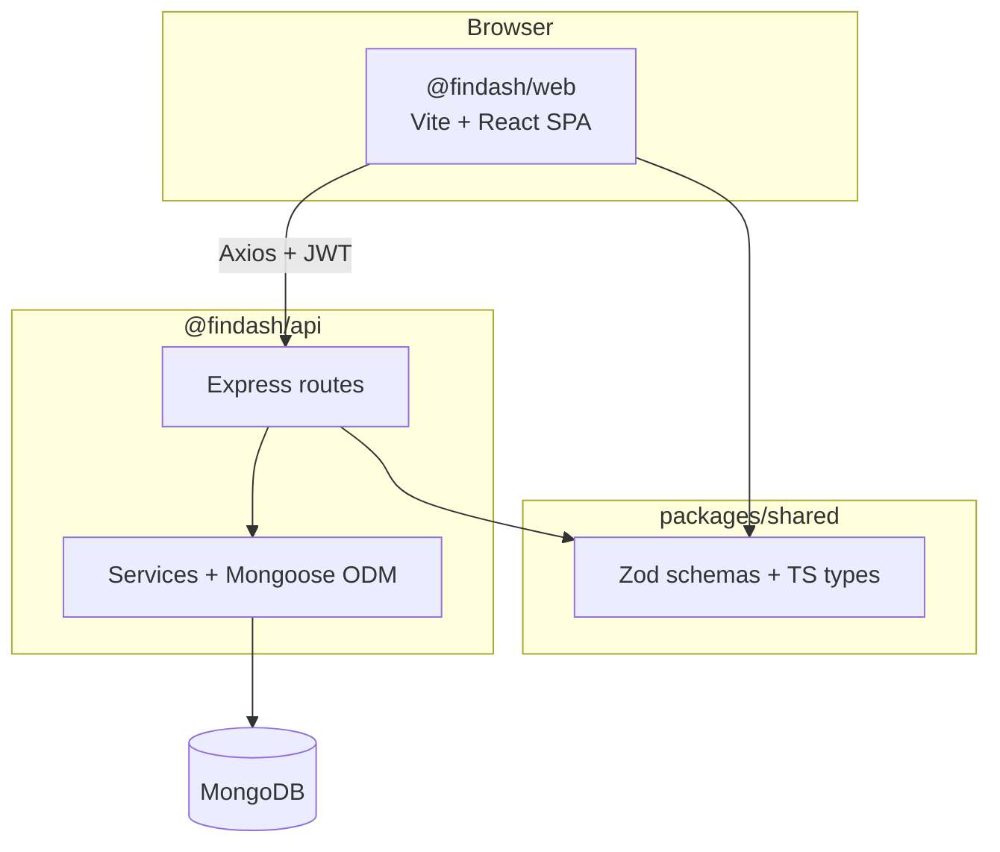

# FinDash

Production-oriented full-stack personal budget analytics SPA built as a TypeScript monorepo.

## Architecture



| Layer | Package | Role |
|-------|---------|------|
| Frontend | `@findash/web` | React SPA, TanStack Query, Zustand auth, Recharts, @dnd-kit |
| Backend | `@findash/api` | REST API, JWT auth, OpenAPI docs at `/api-docs` |
| Shared | `@findash/shared` | Zod validation schemas and TypeScript types used by both apps |

## MVP features

- **Auth** — register, login, logout with short-lived JWT access tokens and rotating hashed refresh tokens
- **Categories** — CRUD, default colors, drag-and-drop reorder (`PATCH /categories/reorder`)
- **Transactions** — CRUD with pagination and filters (type, category, date range, search)
- **Analytics** — summary totals, category breakdown, income/expense trends
- **Dashboard** — configurable widget layout persisted per user; drag-and-drop reorder on the frontend
- **Export** — CSV download of filtered transactions
- **Docs** — interactive OpenAPI UI at [`/api-docs`](http://localhost:3001/api-docs) when the API is running

## Out of scope (deferred)

These are intentionally excluded from the MVP unless trivial to add later:

- Password reset / email verification
- Dark mode
- Scheduled email reports
- Budget targets and alerts
- PWA / offline support
- Bank import / Plaid integration
- Telegram bot
- AI spending forecasts
- Redis caching
- Sentry / LogRocket error tracking
- Multi-origin CORS for Vercel preview deploys (production uses a single `CORS_ORIGIN`)

## Prerequisites

- **Node.js 20 LTS** (see `.nvmrc`)
- **pnpm 9+** (`corepack enable && corepack prepare pnpm@9.15.0 --activate`)
- **MongoDB** running locally or accessible via connection string

## Local development

1. Install dependencies from the repo root:

   ```bash
   pnpm install
   ```

2. Copy environment files:

   ```bash
   cp apps/api/.env.example apps/api/.env
   cp apps/web/.env.example apps/web/.env
   ```

3. Start MongoDB, then run all apps in dev mode:

   ```bash
   pnpm dev
   ```

   Turborepo starts `@findash/shared` (TypeScript watch), `@findash/api`, and `@findash/web` together. Shared types are built once before dev servers start.

   | Service | URL |
   |---------|-----|
   | Web | http://localhost:5173 |
   | API | http://localhost:3001 |
   | Health check | http://localhost:3001/health |
   | OpenAPI docs | http://localhost:3001/api-docs |

Run a single app:

```bash
pnpm --filter @findash/api dev
pnpm --filter @findash/web dev
```

## Environment variables

| Location | Variable | Description |
|----------|----------|-------------|
| `apps/api/.env` | `PORT` | API server port (default `3001`; Railway injects its own `PORT`) |
| `apps/api/.env` | `MONGODB_URI` | MongoDB connection string |
| `apps/api/.env` | `JWT_ACCESS_SECRET` | Secret for short-lived access tokens (use a long random string in production) |
| `apps/api/.env` | `JWT_REFRESH_SECRET` | Secret for refresh token signing (must differ from access secret) |
| `apps/api/.env` | `CORS_ORIGIN` | Allowed frontend origin (exact URL, no trailing slash) |
| `apps/api/.env` | `NODE_ENV` | `development` or `production` |
| `apps/web/.env` | `VITE_API_URL` | Base URL for API requests (no trailing slash) |

In **development**, the API also accepts `http://localhost:5173` and `http://127.0.0.1:5173` regardless of `CORS_ORIGIN`, so the Vite dev server works out of the box.

Do not commit `.env` files. Use the `.env.example` files as templates.

## API overview

All routes except `/health`, `/api-docs`, and `/auth/*` require a `Bearer` access token.

| Area | Endpoints |
|------|-----------|
| Auth | `POST /auth/register`, `/login`, `/refresh`, `/logout` |
| Categories | `GET/POST /categories`, `PATCH /categories/reorder`, `PUT/DELETE /categories/:id` |
| Transactions | `GET/POST /transactions`, `GET /transactions/export.csv`, `GET/PUT/DELETE /transactions/:id` |
| Analytics | `GET /analytics/summary`, `/category-breakdown`, `/trend` |
| Dashboard | `GET/PUT /dashboard/layout` |

Full request/response schemas: **http://localhost:3001/api-docs** (or your deployed API URL + `/api-docs`).

## Testing

Run the full test suite from the repo root:

```bash
pnpm test
```

Run tests for a single package:

```bash
pnpm --filter @findash/api test
pnpm --filter @findash/web test
pnpm --filter @findash/shared test
```

API tests use an in-memory MongoDB (`mongodb-memory-server`); no external database is required for CI or local test runs.

Mirror the CI pipeline locally:

```bash
pnpm run ci
# equivalent to: pnpm lint && pnpm test && pnpm build
```

### MVP smoke checklist

Automated: `apps/api/tests/smoke.test.ts` runs the full API journey in one test.

Manual E2E (with `pnpm dev` and MongoDB running):

1. Open http://localhost:5173 and **register** a new account
2. **Log in** (or continue from registration)
3. **Categories** — create at least two categories; drag to **reorder**
4. **Transactions** — add an expense linked to a category
5. **Analytics** — confirm summary and charts reflect the transaction
6. **Dashboard** — drag widgets to rearrange; refresh and confirm layout persists
7. **Transactions** — click **Export CSV** and verify the download
8. **Logout** — confirm protected routes redirect to login

## CI

GitHub Actions runs on every push and pull request to `main` (see [`.github/workflows/ci.yml`](.github/workflows/ci.yml)):

1. Node.js 20 + pnpm 9.15.0
2. `pnpm install --frozen-lockfile`
3. `pnpm lint`
4. `pnpm test`
5. `pnpm build`

The workflow fails fast on the first failing step.

## Deploy to Vercel (web) + Railway (api)

### Overview

| App | Platform | Config |
|-----|----------|--------|
| `@findash/web` | [Vercel](https://vercel.com) | [`vercel.json`](vercel.json) at repo root |
| `@findash/api` | [Railway](https://railway.com) | [`railway.toml`](railway.toml) + [`apps/api/Dockerfile`](apps/api/Dockerfile) |

Deploy the API first so you have a stable URL for `VITE_API_URL` and `CORS_ORIGIN`.

### Railway (API)

1. Create a new Railway project and connect this GitHub repository.
2. Add a **MongoDB** plugin (or provide your own `MONGODB_URI`).
3. Create a service from the repo. Set the **root directory** to the repository root (not `apps/api`).
4. Railway reads [`railway.toml`](railway.toml) and builds via `apps/api/Dockerfile`.
5. Set these **service variables** in the Railway dashboard:

   | Variable | Example | Notes |
   |----------|---------|-------|
   | `MONGODB_URI` | `mongodb://...` | From Railway MongoDB plugin or external cluster |
   | `JWT_ACCESS_SECRET` | *(random 32+ chars)* | Generate with `openssl rand -base64 32` |
   | `JWT_REFRESH_SECRET` | *(random 32+ chars)* | Must differ from access secret |
   | `CORS_ORIGIN` | `https://your-app.vercel.app` | Production Vercel URL (exact match) |
   | `NODE_ENV` | `production` | Required for production |

   Railway sets `PORT` automatically; do not override it unless you know what you are doing.

6. Deploy. Confirm health at `https://<your-railway-domain>/health` → `{ "status": "ok" }`.

**Preview / staging:** `CORS_ORIGIN` accepts a single origin string in production. For Vercel preview deployments, either point previews at a staging API with matching `CORS_ORIGIN`, or use the production web URL for API testing until you add multi-origin CORS support.

### Vercel (web)

1. Import the GitHub repository in [Vercel](https://vercel.com/new).
2. Leave the **root directory** as the repository root. Vercel picks up [`vercel.json`](vercel.json):

   - Install: `pnpm install`
   - Build: `pnpm --filter @findash/web build`
   - Output: `apps/web/dist`

3. Set **Environment Variables** (Production and Preview as needed):

   | Variable | Example | Notes |
   |----------|---------|-------|
   | `VITE_API_URL` | `https://your-api.up.railway.app` | Railway public API URL, no trailing slash |

4. Deploy. Vercel rewrites non-asset routes to `index.html` for React Router client-side navigation.

5. Update Railway `CORS_ORIGIN` to your Vercel production URL if it changed, then redeploy the API.

### Post-deploy checklist

- [ ] `GET <API_URL>/health` returns `{ "status": "ok" }`
- [ ] Register / login works from the Vercel URL
- [ ] Browser network tab shows API calls to `VITE_API_URL` (not `localhost`)
- [ ] No CORS errors in the browser console

## Workspace structure

```
findash/
├── .github/workflows/ci.yml
├── apps/
│   ├── api/          # Express + Mongoose API
│   └── web/          # Vite + React SPA
├── packages/
│   └── shared/       # Zod schemas and shared TypeScript types
├── railway.toml      # Railway API deployment
└── vercel.json       # Vercel web deployment
```

## Commands

| Command | Description |
|---------|-------------|
| `pnpm dev` | Start shared watch + API + web (ports 3001 / 5173) |
| `pnpm build` | Build all packages and apps |
| `pnpm test` | Run tests across the monorepo |
| `pnpm lint` | Lint all packages |
| `pnpm typecheck` | Type-check all packages |
| `pnpm run ci` | Lint, test, and build (mirrors GitHub Actions) |

## Tech stack

- **Monorepo:** pnpm workspaces + Turborepo
- **Frontend:** React 18, React Router, TanStack Query, Zustand, CSS Modules, Recharts, @dnd-kit
- **Backend:** Express, Mongoose, Zod, JWT, bcrypt
- **Shared:** Zod schemas and TypeScript types in `@findash/shared`
